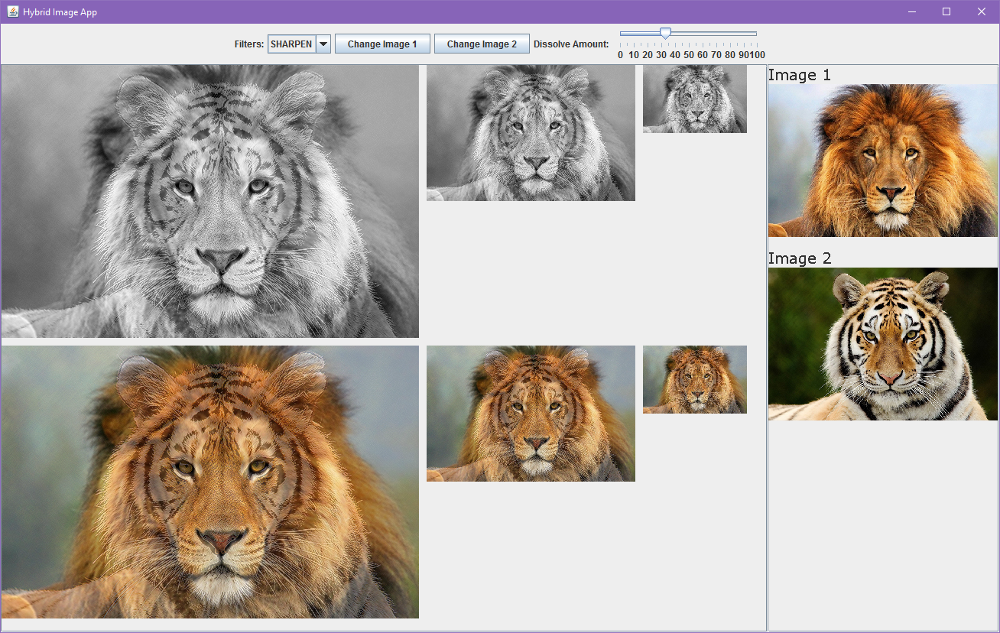

# Hybrid-Image
Java Swing app that allows users to create hybrid images. Users can also change settings such as filters or use their own pictures to create hybrid images with.

## How to Use
The default settings of the app provides a hybrid image created using Sharpen filter with the images dissolved at 50%.

* Select a filter from the dropdown menu to change the convolution matrix that the algorithm uses
* Click the button to choose an image from your local disc. Supported types: .jpg, .jpeg, .png, .gif
* Drag the slider to determine the opacity of the image

## Sample Screenshot

## About
The Hybrid Image algorithm works by taking two images and applying a lowpass filter on one and highpass filter on the other. Then, the resultant images are dissolved together. As a result, the final product is an image which has a blurred image in the background with edges of the other image on the foreground. From a short distance, the main focus will be on the lowpass image (the background). At longer distances, it becomes difficult to focus on the background due to the lack of edges. As a result, the new focus becomes the highpass image (the foreground).